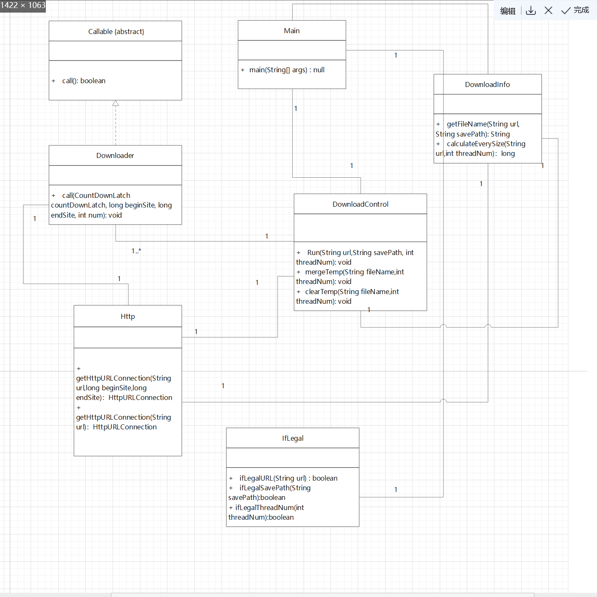

## 四、设计实现过程

### 第1阶段 实现单个文件的下载功能

 本阶段一共设计了6个类

#### Main类：

作为项目的入口，输入url、保存路径、线程数目。

#### DownloadInfo类：

该类包含getFileName函数和calculateEverySize函数，前者getFileName用于获取文件名，后者calculateEverySize用于计算每个线程所要下载的文件块的大小。        

#### Http类：

用于获取HttpURLConnection对象。有两个重载函数HttpURLConnection getHttpURLConnection(String url，long beginSite,long endSite)和HttpURLConnection getHttpURLConnection(String url1)。前者根据起始位置和结束位置获取目标文件的HttpURLConnection，用于分块文件下载；后者直接根据url获取目标文件的HttpURLConnection。

#### Downloader类：

Downloader负责具体的下载任务。根据起始位置，结束位置，和线程的编号，利用IO流实现每个文件块的下载。由于使用了线程池的submit，本类实现了Callable。

#### DownloadControl类：

DownloadControl负责全局掌控。其下有三个方法：

run负责全局掌控，进行下载任务的切分，给每个线程都分配一定的任务，然后利用线程池进行多线程下载。最后调用mergeTemp和clearTemp方法，按照次序合并临时文件，合并完成后清除临时文件。

#### 类IfLegal:

主要判断输入的合法性。即URL，保存路径，线程数是否合法。

#### UML类关系图：

#### 单元测试设计：

根据每个函数的特点，设计相应的单元测试。**详见软件测试.md**
