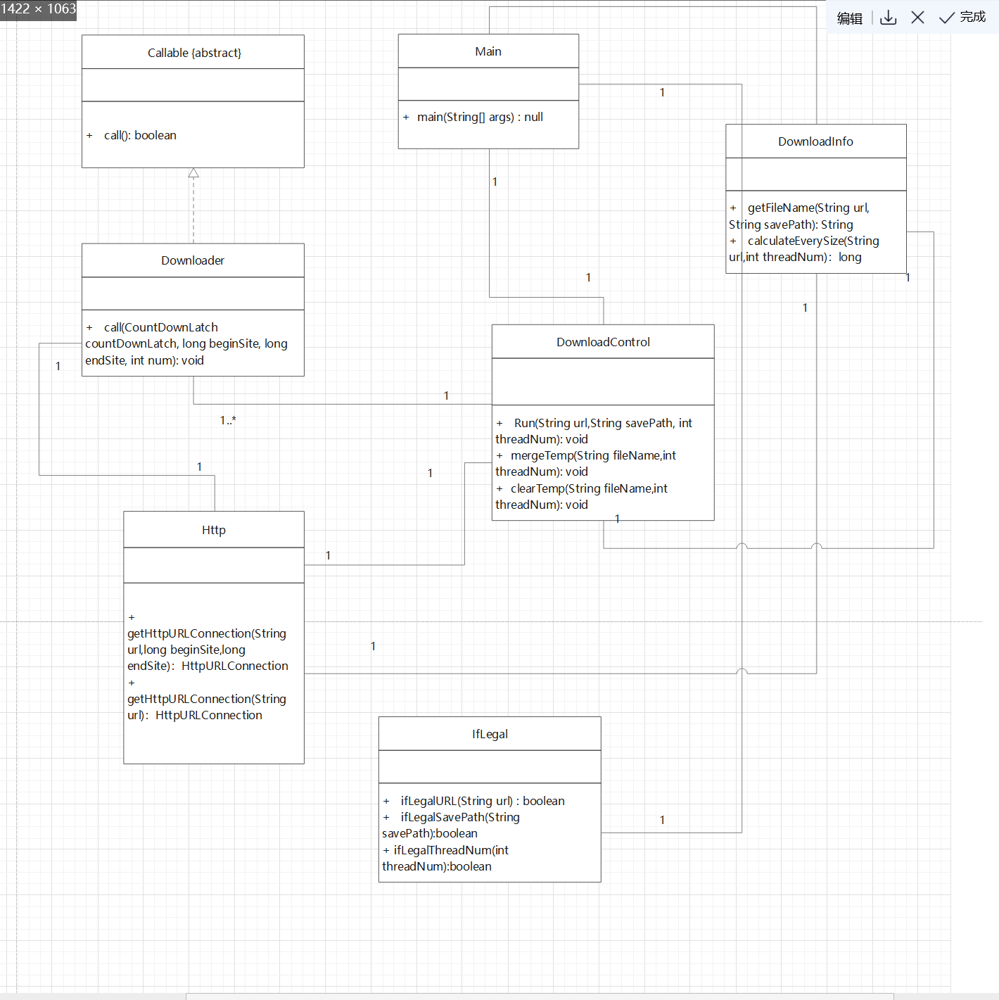

## 设计实现过程

### 第1阶段 实现单个文件的下载功能

第一阶段的要求是，输入url，保存路径，线程数目后实现多线程下载。

大体思路是根据url，获取下载文件的大小。然后根据线程数目，算出来每个线程所要下载的文件块大小。当每个线程负责的文件块下载完毕后，对所有文件按照次序进行合并，最后清除临时文件。

主要用到java中的多线程（线程池），http，IO流，file等方面的知识，主要参考java官方文档和各类博客。

 本阶段一共设计了6个类:

#### Main类：

作为项目的入口，输入url、保存路径、线程数目。

#### DownloadInfo类：

该类包含getFileName函数和calculateEverySize函数，前者getFileName用于获取文件名，后者calculateEverySize用于计算每个线程所要下载的文件块的大小。        

#### Http类：

用于获取HttpURLConnection对象。有两个重载函数HttpURLConnection getHttpURLConnection(String url，long beginSite,long endSite)和HttpURLConnection getHttpURLConnection(String url1)。前者根据起始位置和结束位置获取目标文件的HttpURLConnection，用于分块文件下载；后者直接根据url获取目标文件的HttpURLConnection。

#### Downloader类：

Downloader负责具体的下载任务。根据起始位置，结束位置，和线程的编号，利用IO流实现每个文件块的下载。由于使用了线程池的submit，本类实现了Callable。

#### DownloadControl类：

DownloadControl负责全局掌控。其下有三个方法：

run负责全局掌控，进行下载任务的切分，给每个线程都分配一定的任务，然后利用线程池进行多线程下载。最后调用mergeTemp和clearTemp方法，按照次序合并临时文件，合并完成后清除临时文件。

#### 类IfLegal:

主要判断输入的合法性。即URL，保存路径，线程数是否合法。

#### UML类关系图：

#### 单元测试设计：

根据每个函数的特点，设计相应的单元测试。**详见软件测试.md**

###第2阶段 实现批量多协议文件下载功能

第二阶段主要任务是从文本中获取各类下载链接。

主要思路是，新建一个类UrlReader，专门从输入中获取下载的url。并将获取到的url保存为https的链接形式。其下应该包含三个方法：

#### getFromVariableUrls(String urls)

从输入的参数中获取url。

#### getFromFileUrls(String fileName)

根据文件内容获取url。

#### getFromRegexUrl(String urls，int start, int end)

根据正则表达式获取Url
